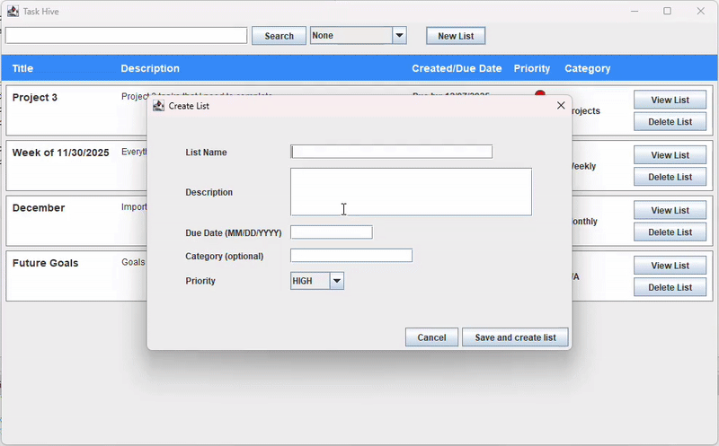

# TaskHiveLaBar.github.io
# TaskHive
*A Visual Java Task-Management Application*

TaskHive is a Java Swing desktop application that helps users organize tasks across multiple categorized lists. Designed for students, professionals, and everyday users, TaskHive provides deadline tracking, priority indicators, color-coded urgency levels, searching, filtering, and persistent local storage with an intuitive GUI.

---

## Features

- **Create & Manage Multiple Lists** — Create custom task lists with names, descriptions, categories, and priorities.
- **Task Management** — Add tasks with descriptions, deadlines, and priority markers. Mark tasks as completed or delete them.
- **Visual Priority & Overdue Indicators** — Tasks dynamically color-code based on urgency.
- **Search & Filtering** — Search across lists/tasks and filter by category, due date, created date, or priority.
- **Local Persistence** — All lists and tasks save automatically and reload on next startup.
- **Robust OOP Architecture** — Built using MVC plus Strategy, Composite, Observer, and Factory patterns.

---

### Application Demo

The gif speed is increased so marking complete appears yellow, but it actually marks it green

### Dashboard View

### Task List View

### Create List Dialog

### Create Task Dialog

### Search

### Filter

